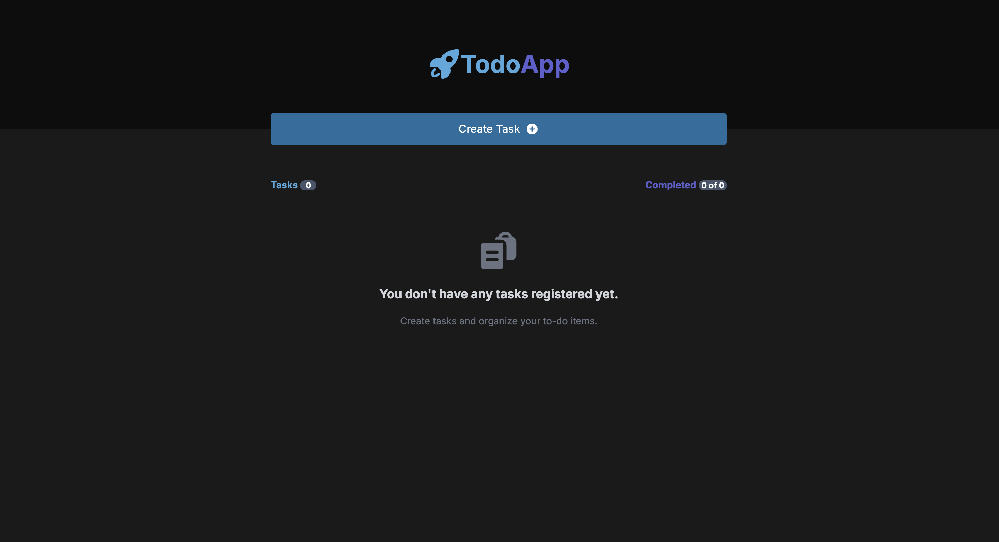
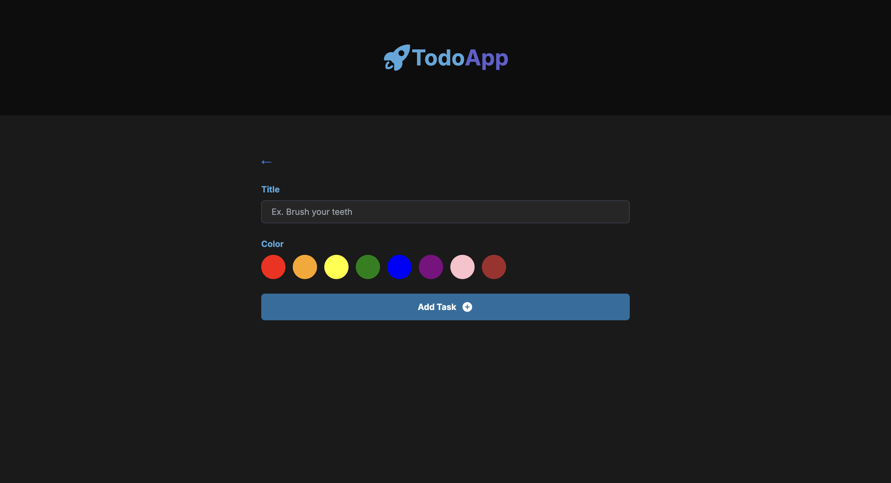
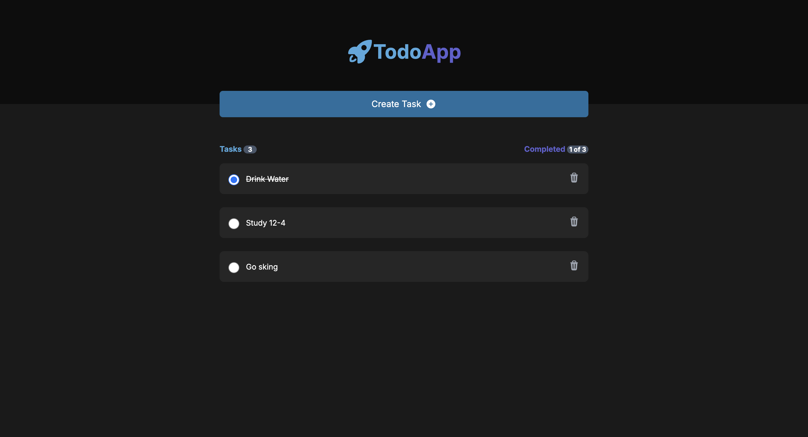
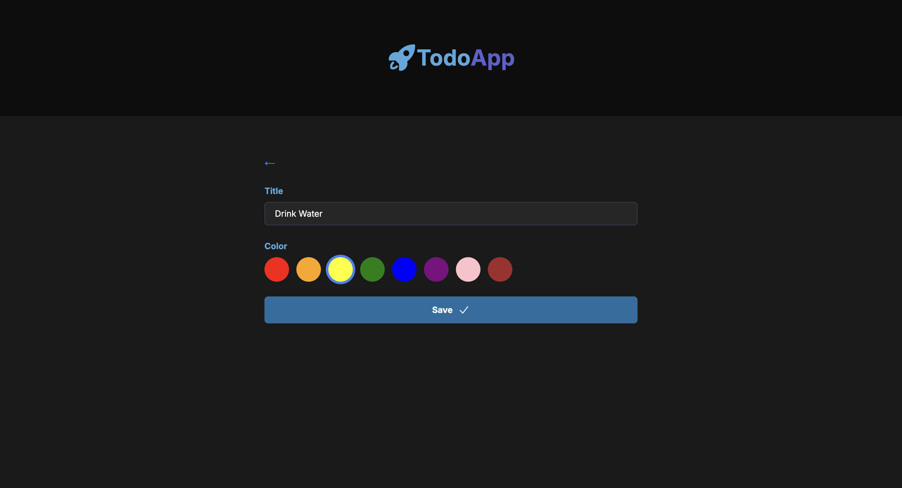
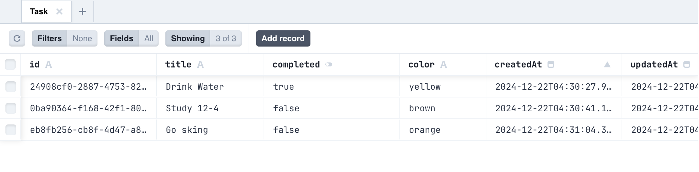

## To-Do Application

This task is designed to evaluate your skills in building a **Full-Stack Todo List App** using **Next.js**, **Express.js**, **Prisma**, and **MySQL**. **Entirely with Typescript, and then Tailwind CSS for frontend.** The goal is to assess your ability to design, build, and document a simple and functional application.







### **Objective**

Build a **Todo List App** where users can:

- Add tasks.
- Edit tasks.
- Mark tasks as Completed/Not Completed.
- Delete tasks.

---

### **Features**

### **1. Home View**

- Displays a list of tasks with:
    - **Title**.
    - Checkbox or toggle to mark as Completed/Not Completed.
    - Delete button.
- Includes:
    - **Create Task** button to navigate to a form for adding tasks.
    - A summary of tasks: "Tasks: X" and "Completed: Y of X".
- Clicking on a task card navigates to the **Edit Task Page**.

### **2. Create/Edit Task Page**

- A form with fields:
    - **Title** (required).
    - **Color** (selectable options, e.g., red, blue, green).
- Behavior:
    - **Create Task**: Saves a new task and redirects to the **Home View**.
    - **Edit Task**: Updates an existing task and redirects to the **Home View**.
    - Navigating back without saving discards changes.

### **3. Additional Features**

- Toggle a task’s completion status directly on the **Home View**.
- Delete tasks with a confirmation prompt.

---

### **Technical Requirements**

1. **Front-End**: Use **Next.js (App Router)**.
    - Follow the provided [Figma Design](https://www.figma.com/design/zHgJzVHfhuN720CjjSGRXQ/Todo-App-Test-Task?node-id=0-1&t=dcgTs4OsZGTxsIJj-1).
    - Ensure responsiveness and clean UI.
    - Use reusable components (e.g., Task Cards, Forms).
2. **Back-End**: Use **Express.js**.
    - REST API Endpoints:
        - `GET /tasks`
        - `POST /tasks`
        - `PUT /tasks/:id`
        - `DELETE /tasks/:id`
3. **Database**: Use **Prisma** with **MySQL**.
    - Tasks should include: `id`, `title`, `color`, `completed` status, and timestamps.


# Getting started with env setup

First, clone this respository:


```bash
git clone https://github.com/iaamar/to-do-frontend.git
```

Second, run the installation modules command:

```bash
npm install
```

Third, run the server:

```bash
npm run dev
```
The backend server runs at [http://localhost:3001](http://localhost:3001), while the frontend server connects to it.  
Visit [http://localhost:3000](http://localhost:3000) in your browser to view the application.
